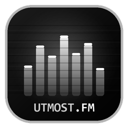

# UTMOST.FM

> Reproductor de música local retro-futurista con visualizador de espectro reactivo,
> letras sincronizadas, 10 temas, efecto CRT y un modo PRO para compositores que se
> conecta a tu carpeta de renders de FL Studio y analiza el mastering en vivo.

Hecho en Python + Tkinter. Reproductor de música **100% local**: tu música, tus
archivos, sin servicios externos para reproducir.



---

## Mini descripción

**UTMOST.FM** es un reproductor de escritorio con estética de TV/synth ochentera: barras
de ecualizador que reaccionan al audio real, letras que se resaltan y avanzan solas
(con click-to-seek estilo Spotify), 10 paletas de color intercambiables, un reloj de
bloques y un filtro CRT con barras rodantes sobre la carátula. Viene en dos sabores:
una **versión estándar** para escuchar tu música, y una **versión PRO** que añade un
puente con **FL Studio** para monitorear y analizar tus bounces mientras produces.

---

## Las dos versiones

| | **Estándar** | **PRO (Studio / Compositor)** |
|---|---|---|
| Archivo fuente | `player.py` | `player_pro.py` |
| Ejecutable | `dist/UTMOST.FM.exe` | `dist/UTMOST.FM_PRO.exe` |
| Perfil de datos | `%APPDATA%\UtmostFM` | `%APPDATA%\UtmostFM_PRO` |
| Para quién | Escuchar música local | Compositores / productores en FL Studio |

Ambas comparten **todo el reproductor**. La PRO **añade** las funciones de estudio
encima — no quita nada.

---

## Funciones comunes (ambas versiones)

- **Reproducción local** con `pygame.mixer`: MP3, FLAC, WAV, OGG, M4A, AAC, OPUS, WMA.
- **Biblioteca por carpeta**: eliges una carpeta y escanea recursivamente; botón de
  rescan para detectar canciones nuevas sin reiniciar.
- **Metadatos + carátula** embebida vía `mutagen` (ID3 / FLAC pictures / MP4).
- **Visualizador de espectro REACTIVO**: precomputa el FFT del archivo con
  `numpy`+`soundfile` y mueve las barras al ritmo real de la canción (no es una
  animación genérica). Posición configurable: **compacto** (sobre los controles) o
  **grande** (sobre las letras).
- **Letras**:
  - `.lrc` al lado del audio para letras **sincronizadas**.
  - `.txt` al lado para letra plana.
  - Si no hay archivo local, busca en **LRCLIB** (con reintentos y fallback robusto).
  - **Click en una línea = saltar a ese momento** de la canción (estilo Spotify).
  - Dos estilos: **clásico** (monospace) o **grande** (Cambria, alineado a la izquierda
    con franja del tema en la línea activa).
- **10 temas**: morado, verde, naranja, azul, rosa, celeste, aqua, rojo, blanco, negro.
- **Tema automático según portada**: analiza el color dominante de la carátula y elige
  el tema que mejor combina (opcional, toggleable).
- **Efecto CRT / TV antigua** sobre la carátula: scanlines, saturación, viñeta,
  aberración cromática y barras rodantes que bajan en bucle.
- **Reloj de bloques** en vivo en el panel derecho (con el mismo efecto CRT, enmascarado
  solo sobre los dígitos).
- **Ventana de ajustes con diseño propio** (sin la barra del SO): barra de título
  custom, borde y colores del tema, arrastrable.
- **Icono propio** embebido (negro con tonos de gris: ecualizador + wordmark).
- Bilingüe **ES / EN**, fullscreen, control de volumen con rueda del mouse, panel
  colapsable, barra de progreso con seek.

### Atajos
| Tecla | Acción |
|---|---|
| espacio | play / pausa |
| flechas izquierda / derecha | anterior / siguiente |
| F11 | pantalla completa |
| ESC | salir de fullscreen / cerrar ajustes |
| rueda sobre la barra de volumen | subir / bajar volumen |
| click en una letra sincronizada | saltar a ese momento |

---

## Funciones exclusivas de la versión PRO

Pensada para usarse **mientras produces en FL Studio** (FL no tiene API en tiempo real,
así que el puente es por **vigilancia de carpetas**, que es robusto y universal).

- **Vigilante de carpetas FL** (polling con anti-rebote de escritura):
  - **Carpeta de export/renders**: cuando bounceas o re-exportas, detecta el render más
    reciente, lo auto-carga, reproduce y analiza.
  - **Carpeta de samples**: los samples nuevos se añaden a la cola sin cortar lo que
    suena.
- **Análisis de mastering** (`numpy` + `soundfile`, en segundo plano):
  - **Loudness LUFS** integrado ITU-R BS.1770 (vía `pyloudnorm`; sin él, estimación RMS).
  - **True Peak** (sobremuestreo 4x) + **detección de clipping**.
  - **Balance espectral** graves / medios / agudos con veredicto.
  - **Estéreo / fase**: correlación L-R (compatibilidad mono) y anchura.
  - **Veredicto global**: *listo para streaming*, *clipping detectado*, *demasiado
    brillante*, etc.
- **Panel STUDIO** con medidores visuales (barra LUFS con objetivo, peak/clip, balance,
  correlación estéreo) + mini-lectura siempre visible en el panel derecho.
- **Exportar optimizado**: genera una copia normalizada al LUFS objetivo (-14 / -9 / -16)
  con techo de -1 dBTP, guardada en `%APPDATA%\UtmostFM_PRO\optimized`.

---

## Uso rápido (ejecutables)

Los `.exe` son portables (no requieren Python instalado):

```
dist\UTMOST.FM.exe        version estandar
dist\UTMOST.FM_PRO.exe    version PRO
```

Nota: al ser una app indie sin firma digital de pago, Windows SmartScreen puede mostrar
una advertencia azul la primera vez. Click en **"Más información"** y luego en
**"Ejecutar de todas formas"**.

1. Abre el `.exe`.
2. Click en el **engranaje** (arriba a la derecha).
3. **EXAMINAR**, elige tu carpeta de música, ajusta tema/idioma/etc. y **GUARDAR Y APLICAR**.
4. (PRO) baja a la sección **FL STUDIO**: activa la vigilancia y elige la carpeta de
   export de FL y, opcional, la de samples.

---

## Ejecutar desde el código fuente

```bash
pip install -r requirements.txt
python player.py        # estandar
python player_pro.py    # PRO
```

### Dependencias (`requirements.txt`)
| Paquete | Para qué |
|---|---|
| `pygame` | reproducción de audio |
| `mutagen` | metadatos + carátulas |
| `Pillow` | imágenes / efecto CRT |
| `requests` | letras desde LRCLIB |
| `numpy` | FFT del espectro y análisis |
| `soundfile` | leer audio para FFT / análisis |
| `pyloudnorm` | **(solo PRO)** LUFS preciso BS.1770 (opcional) |

---

## Regenerar el icono

El icono se genera con Pillow desde `make_icon.py` (la fuente vectorial es `icon.svg`):

```bash
python make_icon.py     # produce icon.png + icon.ico
```

---

## Recompilar los ejecutables

```bash
pip install pyinstaller
pyinstaller --onefile --windowed --icon icon.ico --add-data "icon.ico;." --add-data "icon.png;." --name "UTMOST.FM"     player.py
pyinstaller --onefile --windowed --icon icon.ico --add-data "icon.ico;." --add-data "icon.png;." --name "UTMOST.FM_PRO" player_pro.py
```
(En Linux/macOS el separador de `--add-data` es `:` en vez de `;`.)

---

## Estructura del proyecto

```
player.py            reproductor estandar
player_pro.py        reproductor PRO (FL Studio + Studio)
icon.svg             icono vectorial (fuente)
icon.png / icon.ico  icono rasterizado (ventana + .exe)
make_icon.py         generador del icono
requirements.txt     dependencias
dist/                ejecutables compilados
```

---

## Créditos

Sígueme en mis redes: **https://linktr.ee/bri_serrubz**
